# Harmony

Harmony is a full-stack e-commerce web application built with React, TypeScript, Node.js, Express.js, MongoDB. The project demonstrates modern web development practices through features such as secure authentication, role-based authorization, product management, shopping cart functionality, order processing, pagination, and a responsive user interface.
---

## 🚀 Live Demo

Frontend: [Live](https://mern-e-commerce-henna-seven.vercel.app)

Backend API: [Live](https://mern-e-commerce-production-7599.up.railway.app)

---

## 📸 Screenshots


### Authentication


### Client Login Page

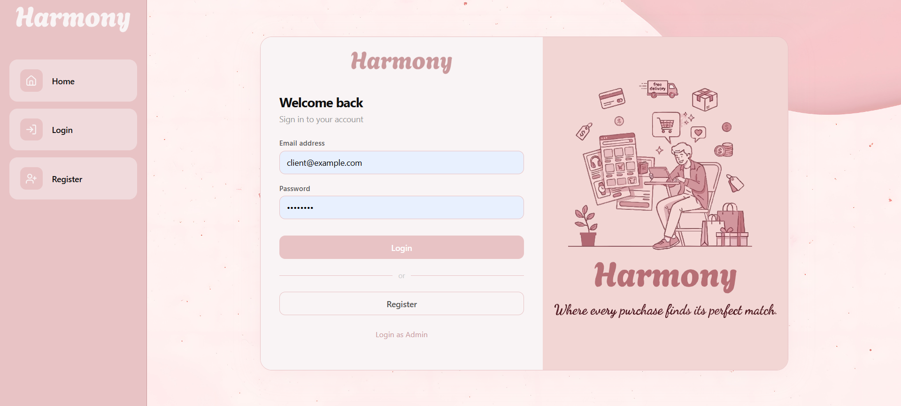

### Register Page

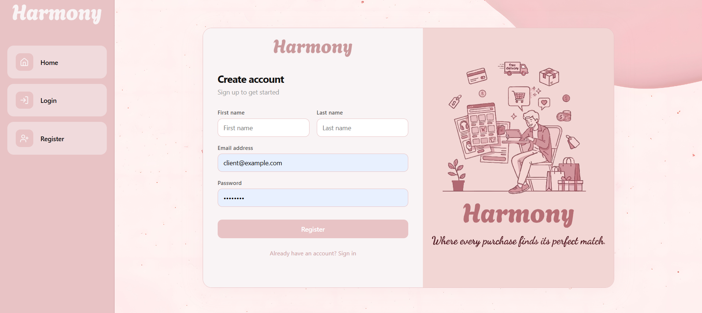

### Admin Login Page

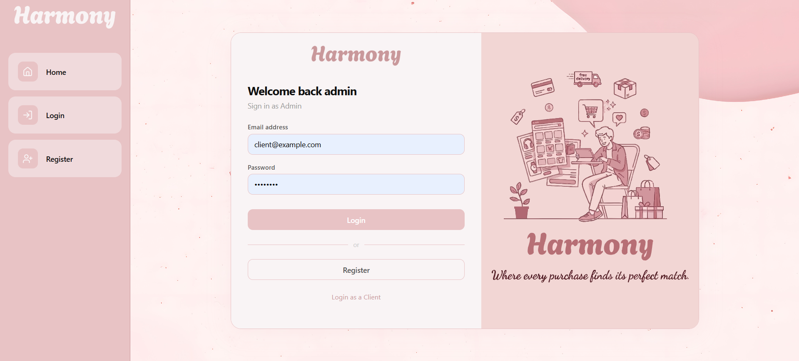


---

### Customer Experience


### Home Page

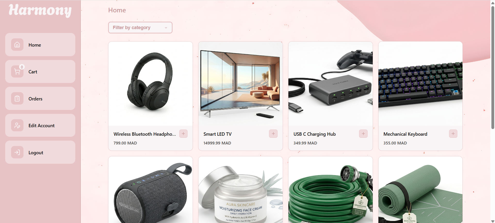

### Product Details

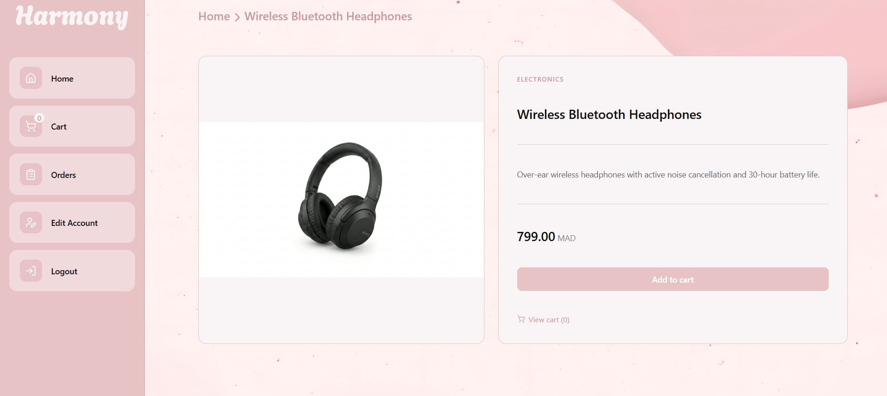

### Edit Profile Page

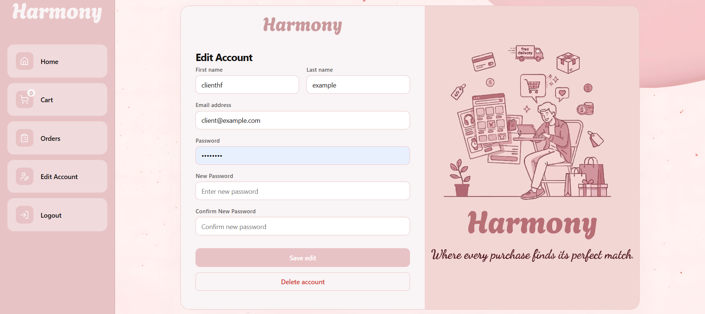

### Cart

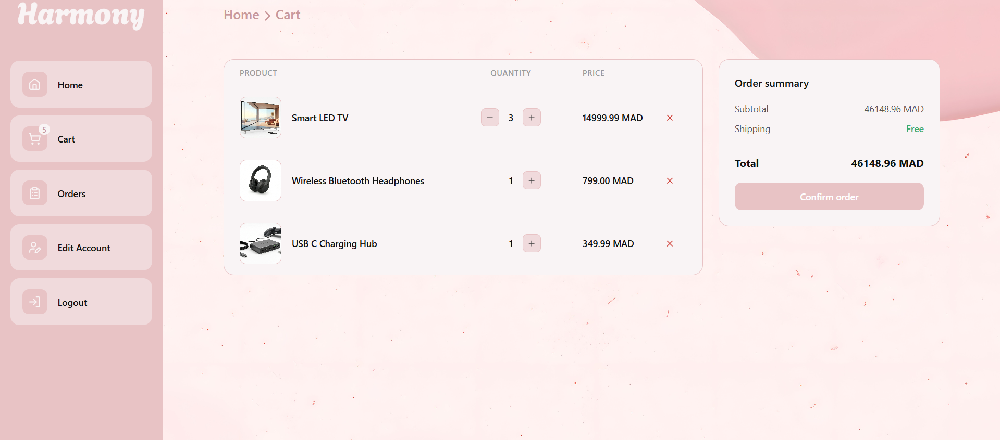

### Send Order Page

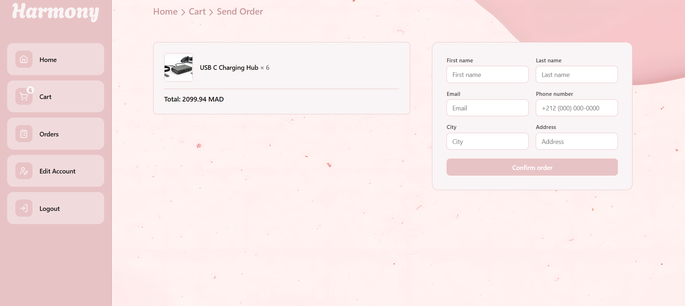

### Client Order Page

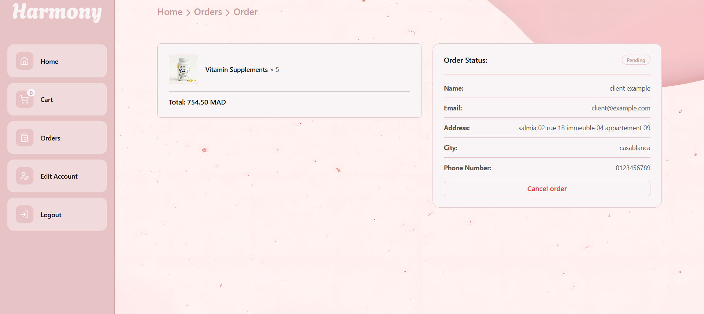


---

### Admin Dashboard


### Edit Product Page

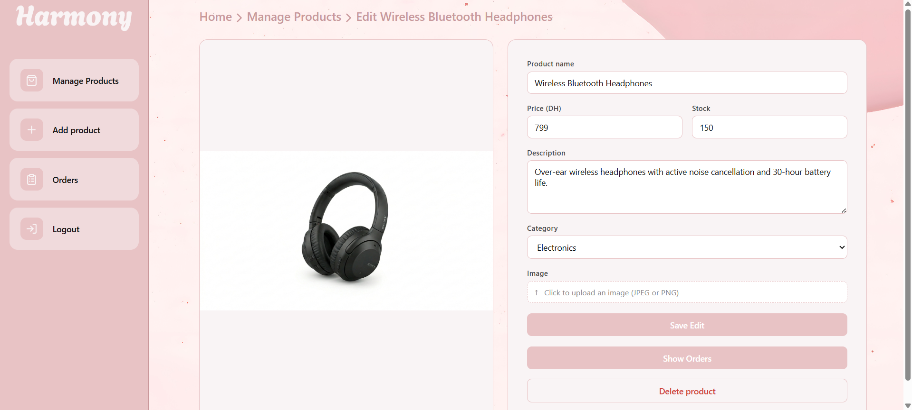

### Add Product Page

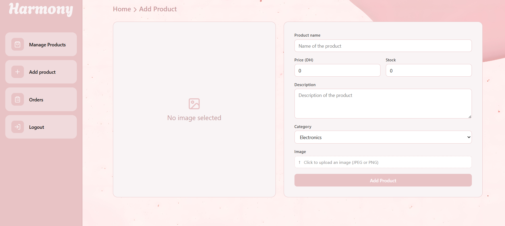

### Admin Order Page

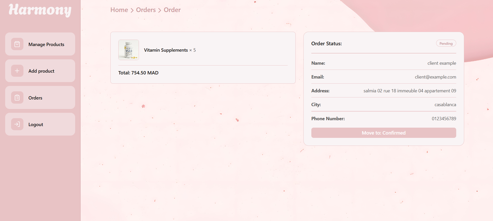


---

## ✨ Features

### Authentication & Authorization

### Authentication & Authorization
- [x] User registration
- [x] User login
- [x] JWT authentication
- [x] Refresh tokens
- [x] Protected routes
- [x] Role-based authorization

### User Features
- [x] Browse products
- [x] Filter products
- [x] Pagination
- [x] View product details

### Shopping Cart
- [x] Add products to cart
- [x] Remove products from cart
- [x] Update quantities
- [x] Persist cart

### Orders
- [x] Place orders
- [x] View order history
- [x] Track order status

### Admin Features
- [x] Create products
- [x] Update products
- [x] Delete products
- [x] Manage orders

---

## 📌 Key Features Overview

- Separate client & admin system
- Secure JWT authentication with refresh tokens
- Role-based access control
- Full cart & order system
- Image upload support for products
- Pagination and filtering

---

## 🛠️ Tech Stack

### Frontend
- React.js
- TypeScript
- React Router
- Axios
- CSS Modules

### Backend
- Node.js
- Express.js
- JWT
- REST API

### Database
- MongoDB

### Storage
- Cloudinary (image uploads)

### Deployment
- Vercel (frontend)
- Railway (backend)
- MongoDB Atlas (database)

### Other Tools
- Git
- GitHub
- Postman
- Vite

---

## 📂 Project Structure

```text
project-root/
│
├── client/
│   ├── src/
│   ├── public/
│   ├── package.json
│   └── .env
│
├── server/
│   ├── src/
│   ├── public/
│   ├── package.json
│   └── .env
│
├── screenshots/
│
├── README.md
│
└── .gitignore
```

---

## ⚙️ Installation

### Clone Repository

```bash
git clone https://github.com/AhmedJrainija/MERN-e-commerce.git
```

### Navigate to Project

```bash
cd MERN-e-commerce
```

---

## Frontend Setup

```bash
cd client
npm install
npm run dev
```

Frontend will run on:

```text
http://localhost:5173
```

---

## Backend Setup

```bash
cd server
npm install
npm start
```

Backend will run on:

```text
http://localhost:3000
```

---

## 🔐 Environment Variables

Create a `.env` file inside the server folder:

```env

PORT=3000

DB_URL=mongodb://127.0.0.1:27017/eCommerce

ADMIN_EMAIL=your_admin_email
ADMIN_PASSWORD=your_admin_password

ACCESS_TOKEN_SECRET=your_access_secret
REFRESH_TOKEN_SECRET=your_refresh_secret

CLOUDINARY_CLOUD_NAME=your_cloud_name
CLOUDINARY_API_KEY=your_cloudinary_api_key
CLOUDINARY_API_SECRET=your_cloudinary_api_secret
```


Create a `.env` file inside the client folder:

```env

VITE_API_URL=http://localhost:3000
```

---

## 📡 API Endpoints

### Base URL

```text
http://localhost:3000
```


### Client Routes

#### Authentication

```http
POST   /register
POST   /login
GET    /logout
GET    /refreshToken
```

#### Account Management

```http
GET    /profile
PATCH  /profile
DELETE /profile
```

#### Products

```http
GET    /product/:productId
POST   /product/:productId
POST   /add/:productId
```

#### Shopping Cart

```http
GET    /cart
PATCH  /cart/:productId/add
PATCH  /cart/:productId/substract
DELETE /cart/:productId
POST   /cart/order
```

#### Orders

```http
GET    /orders
GET    /orders/:orderId
DELETE /orders/:orderId
```


### Admin Routes

#### Authentication

```http
POST   /admin/login
GET    /admin/logout
GET    /admin/refreshToken
```

#### Product Management

```http
GET    /admin/products
GET    /admin/product/:productId
POST   /admin/add
PATCH  /admin/product/:productId
DELETE /admin/product/:productId
```

#### Order Management

```http
GET    /admin/orders
GET    /admin/orders/:orderId
GET    /admin/product/:productId/orders
PATCH  /admin/orders/:orderId/status/:status
DELETE /admin/orders/:orderId
```


## 🔮 Future Improvements

- [ ] Payment integration
- [ ] Product reviews
- [ ] Wishlist
- [ ] Email notifications
- [ ] Multi-language support
- [ ] Dark mode
- [ ] Mobile application

---

## 👨‍💻 Author

**Ahmed Jrainija**

GitHub: https://github.com/AhmedJrainija

LinkedIn: https://www.linkedin.com/in/ahmed-jrainija-172406374/